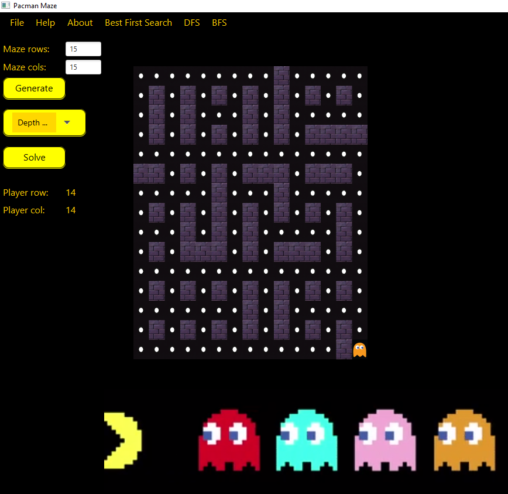

# README: Maze Generation and Solver Project

# Overview
This project is a comprehensive Java-based application that generates, displays, compresses, and solves mazes using various algorithms. The design draws inspiration from classic arcade aesthetics, such as Pac-Man, and features engaging graphics and interactive functionality.

# Features
Maze Generation: Multiple algorithms to generate complex mazes.

Maze Solving: Search algorithms to find the shortest or most efficient path.

Compression and Decompression: Efficiently compress and decompress mazes to optimize storage.

Graphical User Interface (GUI): Interactive display for generating and solving mazes.

Custom Styling: PacMan-themed UI components for a retro feel.

# Project Structure
The project is organized into the following components:

Maze Generators

AMazeGenerator.java: Abstract class providing a blueprint for maze generation.
EmptyMazeGenerator.java: Generates an empty maze without walls.
MyMazeGenerator.java: Implements a custom maze generation algorithm.
SimpleMazeGenerator.java: A simple maze generator for demonstration.
Maze Representation

Maze.java: Represents the maze structure and provides utility functions.
Position.java: Represents a position within the maze.
Search Algorithms

DepthFirstSearch.java: Implements a depth-first search for maze solving.
BestFirstSearch.java: Implements a best-first search algorithm.
ISearchable.java: Interface for making mazes searchable.
ISearchingAlgorithm.java: Interface for search algorithms.
SearchableMaze.java: Adapts a maze to be searchable by algorithms.
MazeState.java: Represents a state within the maze.
Compression

SimpleCompressorOutputStream.java: Compresses a maze using a simple run-length encoding.
SimpleDecompressorInputStream.java: Decompresses the maze data.
Server and Client Communication

Server.java, Client.java: Handles server-client interactions.
IServerStrategy.java, IClientStrategy.java: Interfaces for strategies used in server-client communication.
ServerStrategyGenerateMaze.java: Strategy for generating mazes on the server.
ServerStrategySolveSearchProblem.java: Strategy for solving mazes on the server.
GUI Components

MazeDisplayer.java: Custom component to display the maze graphically.
View.java, MyView.fxml, MainStyle.css: Files that handle the graphical user interface, styled with a Pac-Man theme.
CSS Styling: The UI elements are styled using a retro Pac-Man theme, with yellow highlights and blue maze walls​(MainStyle).
Utility and Configuration

Configurations.java: Handles configurations for the project.
Demo and Execution

RunMazeGenerator.java, RunSearchOnMaze.java: Example classes to run and test maze generation and solving.
RunCompressDecompressMaze.java: Demonstrates maze compression and decompression.
RunCommunicateWithServers.java: Example of server-client communication in action.
Main.java: Entry point for the application.

# Resources
Images: ghost.png, Pacman2.png, path2.png, and more for a themed experience.
Audio: pacman-theme.mp3 to enhance the retro atmosphere.
Video: GIF.mp4 demonstrating the maze generation and solving in action.
